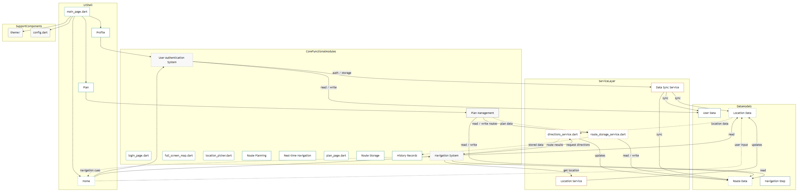

# StepScape — A Walking Route Planning Tool

   

- **GitHub Repo**: [StepScape Official Github Repo](https://github.com/SiruiLuo/casa0015-StepScape)
- **GitHub Landing Page**: [StepScape Official Website](https://siruiluo.github.io/casa0015-StepScape/)
---

## Abstract

Nowadays, people are under increasing pressure in life. Many people who are tired of work have lost their connection with the environment, and even taking a walk has become difficult. StepScape is a software that focuses on automatically planning users' walking routes based on their moods and activity themes. By identifying the user's current location and the place they want to go, and integrating multiple apis, it provides convenience for users to quickly determine their walking routes. The carefully planned scenery along the way soothes the tired and anxious heart.

---

## Problem Statement & User Persona
### 1.Background

In today's fast-paced society, office and academic pressure almost fill everyone's heart. The fast-paced life leaves people with even less time to pay attention to the quality of personal rest and relaxation. This leads to the accumulation of pressure and nowhere to release it. But Clear, Quantitative Benefits Pre–post and controlled trials(Fischer, 2019; Ryde et al., 2022) show that short- to moderate-duration walking (≥10–30 minutes, 3-5 times/week) Lead to measurable reductions in perceived stress, psychological distress (K10) negative affect, and work strain/fatigue Benefits are most pronounced in those with higher baseline stress or psychological distress(Sianoja et al., 2018; Thøgersen-Ntoumani et al., 2015). However, for ordinary people in cities, the pace of life is overly rigid. The monotonous lifestyle of going back and forth between home and work makes it even more difficult for them to set aside some time for a walk. Moreover, in cities, it is particularly difficult to choose an excellent walking route. People are often affected by noise and poor air quality when taking a walk. Therefore, with the aim of cultivating the habit of walking and optimizing the walking route, a walking route planning software based on relaxation and mood relief is particularly necessary. It should have several major functions, such as setting the starting point and focus, planning the walking time, and choosing the type of mood one wants to experience. And the routes that users like should be collected, and the search records of users should be retained.

### 2.Target Persona
| Name | Age | Occupation | Goal | Pain Point |
|------|-----|-----------|------|------------|
| Alice | 28 | Product Manager | Relax in a 30-min “Quiet + Scenic” walk | Routes feel monotonous |

---

## Design Journey (UX)
### 1.Storyboard

   
  <b>Fig.1</b> Hand-drawn Story Board

### 2.Information Architecture

   
  <b>Fig.2</b> nformation Architecture Graph

The construction of information mainly involves the interaction between Tag classes and POI classes and the storage of containers. The data transmission process mainly involves the route planning algorithm searching for POI data in the Tag class API (forward transmission) and matching different Tag classes through POI data (reverse transmission). These two types of transfer processes indicate that the Tag class and the POI class containers are in a mutually inclusive state, and both are stored in the Routing parent class as the basis for determining the planned route.

---
## System Architecture Overview

   
  <b>Fig.3</b> System Architecture Graph

As shown in the above figure, this system mainly determines the parameters before generating the route at the back end by capturing the tags selected by the user. For example, when the user selects "Short Trip", the route parameter is set to 1, which means that the route planning follows the shortest path. When choosing Walking/Jogging, etc., the parameters will gradually increase, which means that the route planning allows for detours. When requesting a POI, the back-end judgment needs to conduct keyword search based on the tags selected by the front-end user. For example, when "Quiet" is chosen, the back-end will search for places with quiet attributes such as "Park" and "Garden" within a radius of 50 meters, and randomly sample five strongly related points in the route planning, and plan the route to pass through these five points. Finally, after all the parameters and strongly correlated points are confirmed, the longitude and latitude data of the passed points are sent to the OSRM API to plan the route. At the same time, the road data of geolocator is requested and the route prompt is generated and displayed below.

---
## Route Optimisation Algorithm
### 1.Tag → POI Mapping
For Tag data, it contains basic information such as ID, name, and icon, while classification information includes the category to which it belongs (such as catering, scenic spots, etc.). The weights and priorities are also included in the array as metadata. The POI (Point of Interest) data structure includes basic information such as ID, name, and location coordinates, as well as attribute information such as description, image, and rating. Its mapping relationship is a many-to-many relationship (one POI can be associated with multiple tags, and one Tag can be associated with multiple POIs). The process of its data flow is to search for the POI associated with the Tag according to the definition of the Tag, that is, the final search result of the POI will be passed to the array managed by the Tag.

### 2.Distance-Factor Formula
The distance formula is determined by the simple product method as follows：
targetDistance = baseDistance × themeFactor

| Theme       | Factor |
|-------------|--------|
| Short Trip  | 1.0    |
| Walking     | 1.2    |
| Jogging     | 1.4    |
| Cycling     | 1.6    |
| Hiking      | 2.0    |

### 3.Route Optimisation Flow
The optimisation flow is a comprehensive process designed to generate personalized, scenic, and efficient walking routes.  It begins by acquiring the user's current location (P₀), validating its accuracy, and setting a search radius based on user preferences.  Using the Overpass API, a candidate set of POIs is collected by filtering geographic scope, POI types, and attribute conditions, followed by data cleaning.  Waypoint selection is driven by theme relevance, mood scoring, diversity balance, and a greedy algorithm that chooses the top k points while considering constraints like distance, time, accessibility, and user preferences.  The route planning stage utilizes the OSRM API to generate a round-trip walking route from P₀ through selected waypoints, optimizing to minimize distance, avoid repetition, and account for terrain or obstacles.  Route scoring incorporates scenic quality, POI density, visual diversity, and historical value, alongside penalties for length and physical effort.  A final weighted score ranks the routes based on scenic appeal, efficiency, and personal preferences.  The output is delivered in GeoJSON format, including geometry, attributes, estimated duration, difficulty, and justification for the recommendation.  Throughout, the system ensures high computational efficiency through parallelism and caching, maintains data quality with real-time checks, and prioritizes user experience with fast, diverse, and personalized results.  Exception handling covers network, data, and computational anomalies, ensuring robust fallback strategies.  This pipeline enables reliable, engaging, and customized route planning that balances performance with user satisfaction.

---

## API Integration & Error Handling
This project adopts a modular API integration architecture and is centered around four core services: Map service (based on OpenStreetMap map and geocoding API), route planning service (calling OSRM to calculate and optimize walking paths), location service (providing positioning, location update and geofencing functions), and data service (obtaining POI data using Overpass API) And manage user data and route storage. All apis are encapsulated through a unified interface layer, achieving standardization of request parameters and unification of response formats. At the same time, it supports dynamic service registration, load balancing, and authentication and authorization mechanisms to ensure the security and scalability of API access.

In terms of error handling, the system has designed a hierarchical recovery strategy for network anomalies, data errors, and business logic anomalies. Combined with scenarios such as connection timeouts, data verification, and permission verification, it supports retry mechanisms, function degradation, and local fault tolerance. Combined with real-time monitoring, log recording and intelligent alerts, it can promptly capture system bottlenecks and abnormal trends.

---

## UI Highlights & Interactions

   
  <b>Fig.4</b> UI Highlights

The project adheres to the design principles of simplicity, cleanliness, freshness and comfort, and has built a beautiful UI system. In terms of layout, Scaffold is used as the basic framework. All pages in it have a blue gradient color as the background color, and dark blue and purple as the button colors. These colors serve as the basic colors throughout the software, and flexible page layout and floating element positioning are achieved by combining Container, Column/Row and Stack. In terms of interaction, search, click and gesture operations are supported through TextField, Button and Gesture Detector. The map function uses FlutterMap in combination with Marker and Polyline to achieve map display, location marking and route drawing. It supports single/two-finger touch logic and allows for free clicking to zoom in and out of the map. Secondly, the page part should be left appropriately blank, and the functional divisions should be clear. In terms of the map, it supports single/two-finger touch logic, allowing for free clicking to zoom in and out of the map. The historical search and favorites page stores route information and user-set parameters in the form of separate independent tags. Finally, for page switching and loading, a transition page was created as a visual buffer using the basic Animated Container, and animation effects were added to both the entry and exit transition pages.

---

## User Testing

The public beta version of the software was launched on Github on April 19, 2025. During this period, students were widely invited to participate in the software stability test. Regarding the core function of the project, route customization, most testers chose to use the software of this project as the software for route planning during walking instead of using the conventional Google Maps to calculate the shortest walking distance. In the early stage of the software, due to the use of Google Places/Directions/Air Quality API, these paid apis led to a large amount of cost consumption, so that the developers could not afford the funds for developing StepScape. Later, when it was found that the consumption of charges was too high, the usage of the API was adjusted in a timely manner based on user feedback, and the paid API was gradually replaced with free ones.

---

## Limitations & Future Work

The biggest limitation of this project during its development lies in its excessive reliance on the API. As a result, if the API does not operate normally or the service provider does not offer free services, the software will be completely unable to run properly. Secondly, the offline function of this project is almost zero. Since the utilization of users' local data was not involved at all during the project development, the activation of StepScape and the normal loading of the software completely rely on network services. The third point is that the data storage format is overly simple, basically relying on local storage and not involving the data storage business of cloud servers. Finally, the personalized customization algorithm of the route still needs to be strengthened. Currently, the number of Mood tags involved is still too small. If the number of Mood tags is to be increased, enhancing the composite judgment algorithm is indispensable.

For future work, the project will avoid the waste of fees caused by the use of paid apis mentioned in the previous section and still maintain the utilization of free apis. Secondly, an offline map function should be established for the project. Specifically, offline maps should be downloaded based on the places where users frequently stay, providing a more robust solution for users to use the StepScape service in that area. Thirdly, a cloud service platform and cloud community should be established for the project to enable more users of StepScape to exchange experiences within the community. Finally, introduce more apis that can assist in route judgment. For example, the free Air quality API can be utilized to add more judgment factors to the Fresh Air algorithm, thereby obtaining the optimal route planning result in general.

---

## Biblography

1. Fischer, K.J. (2019) ‘The Impact of a Short-Term Walking Intervention to Decrease Perceived Stress’, American Journal of Health Studies, 34(4). Available at: https://doi.org/10.47779/ajhs.2019.50.

2. Introducing outdoor office work to reduce stress among office workers in Sweden | European Journal of Public Health | Oxford Academic (no date). Available at: https://academic.oup.com/eurpub/article/33/Supplement_2/ckad160.1342/7327508 (Accessed: 29 April 2025).

3. Javan Abraham, F. et al. (2023) ‘Introducing outdoor office work to reduce stress among office workers in Sweden’, European Journal of Public Health, 33(Supplement_2), p. ckad160.1342. Available at: https://doi.org/10.1093/eurpub/ckad160.1342.

4. Ryde, G.C. et al. (2022) ‘Measuring Productivity, Perceived Stress and Work Engagement of a Nationally Delivered Workplace Step Count Challenge’, International Journal of Environmental Research and Public Health, 19(3), p. 1843. Available at: https://doi.org/10.3390/ijerph19031843.

5. Sianoja, M. et al. (2018) ‘Enhancing daily well-being at work through lunchtime park walks and relaxation exercises: Recovery experiences as mediators’, Journal of Occupational Health Psychology, 23(3), pp. 428–442. Available at: https://doi.org/10.1037/ocp0000083.

6. Thøgersen-Ntoumani, C. et al. (2015) ‘Changes in work affect in response to lunchtime walking in previously physically inactive employees: A randomized trial’, Scandinavian Journal of Medicine & Science in Sports, 25(6), pp. 778–787. Available at: https://doi.org/10.1111/sms.12398.

----

## Declaration of Authorship

I, Sirui Luo, confirm that the work presented in this assessment is my own. Where information has been derived from other sources, I confirm that this has been indicated in the work.

***Sirui Luo***

ASSESSMENT DATE
